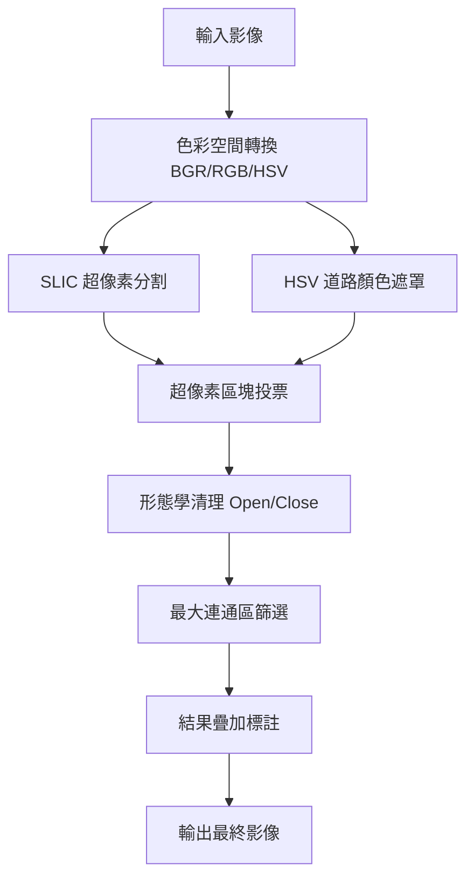

# Road Detection (道路辨識)

## 一、需求
* **輸入**：含直線道路、街景及天空之影像。
  * **影像解析度**：以 **1280x720** 為基準（此解析度可達到最穩定的 SLIC 超像素分群效果）。
* **輸出**：於道路區域疊加 50% 半透明紅色標記之影像。

## 二、分析
本專案專注於柏油路面之語義分割與標註：
* **色彩特徵**：鎖定 HSV 空間低飽和度區間，排除背景雜質。
* **空間一致性**：SLIC 超像素（Simple Linear Iterative Clustering）可精確貼合柏油路與邊界的輪廓。
* **區域完整性**：藉由最大連通區篩選，剔除路邊雜物。

## 三、設計
### 1. 檔案目錄結構 (Optimized Folder Structure)
```bash
.
├── road_detection.py      # 主程式：執行道路辨識與結果輸出
├── road_analysis.py       # 分析腳本：特徵測試與影像預處理
├── requirements.txt       # 專案依賴項
├── input_images/          # [INPUT] 原始柏油路影像存放區
├── output_results/        # [OUTPUT] 辨識結果輸出區
└───process_comparison/    # [STAGES] 處理流程階段對比圖 (1280x720)

```

### 2. 系統架構流程 (Pipeline via Mermaid)


### 3. Pipeline 演算法細節
1. **空間轉換**：同步處理 RGB、Gray 及 HSV 色彩空間。
2. **SLIC 分群**：分割影像為 300 個超像素區塊。
3. **HSV 遮罩**：鎖定低飽和度（灰色）區域。
4. **區塊投票**：若超像素區塊內有超過 50% 道路像素，則判定該區塊為道路。
5. **形態學清理**：執行 Close 與 Open 運算，平滑邊緣並去除噪點。
6. **最大連通區**：定位影像中面積最大的物件作為主道路。
7. **Alpha Blending**：影像疊加顯示，標註偵測範圍。

## 四、結果圖
### 1. 最終道路區域標註 (Overlay Results)
| 測試場景 | 辨識成果 |
| :---: | :---: |
| <br>*Fig 1.1 道路中心線標註* | <br>*Fig 1.2 側向邊界偵測* |
| <br>*Fig 1.3 遠景道路處理* | <br>*Fig 1.4 不同光照穩定性* |

### 2. 階段性對比 (Stages Comparison)

*Fig 2.1 影像處理流程對比：原始影像 (1280x720) ➜ SLIC 分割 ➜ 最終 Mask*

---

## 五、參考資料 (References)
1. **Achanta, R., et al.** "SLIC Superpixels Compared to State-of-the-art Superpixel Methods." *IEEE PAMI*, 2012.

---

## 附錄：部署說明
```bash
pip install pipenv && pipenv shell
pip install -r requirements.txt
```
