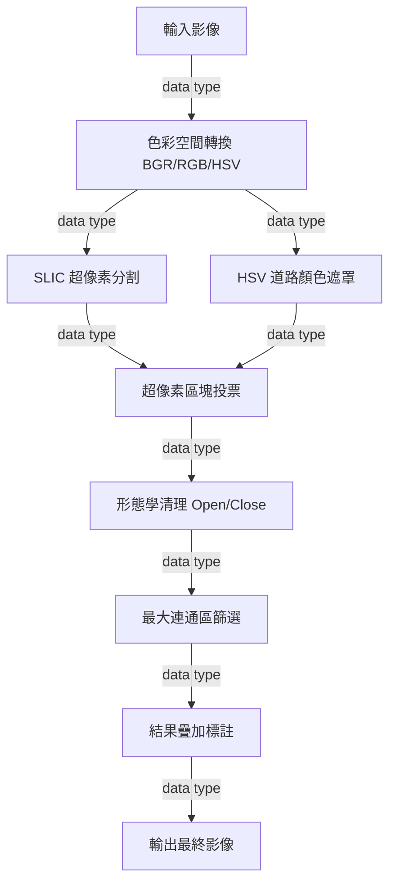
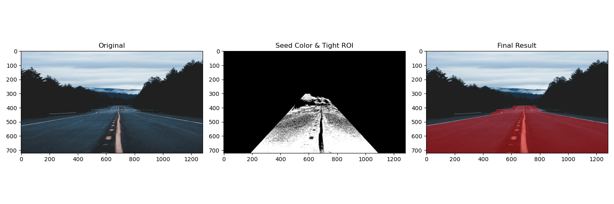
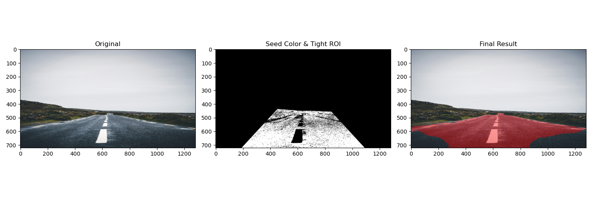
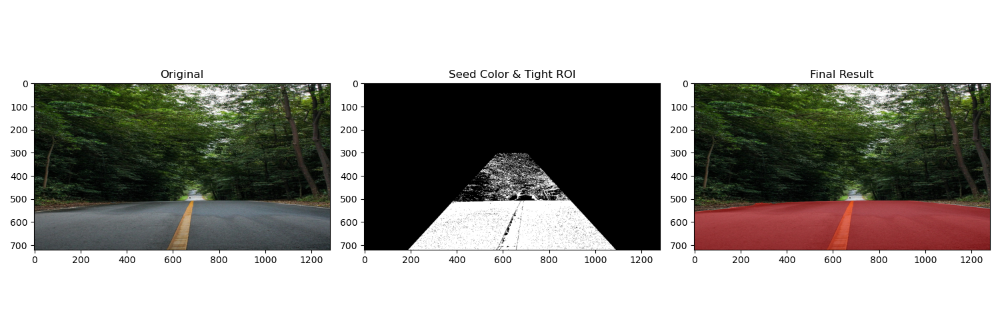
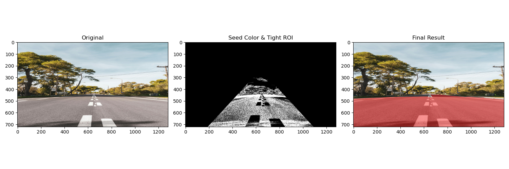
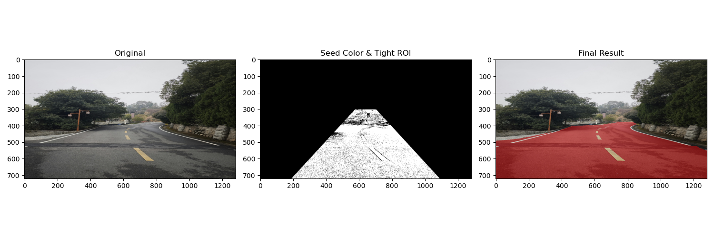
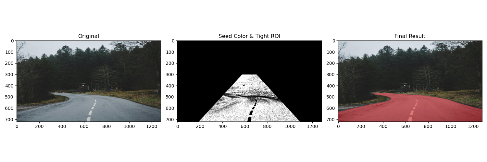

# Road Detection (道路辨識)

## 一、需求
* **輸入**：含直線道路、街景及天空之影像。
  * **影像解析度**：以 **1280x720** 為基準（此解析度可達到最穩定的 SLIC 超像素分群效果）。
* **輸出**：於道路區域疊加 50% 半透明紅色標記之影像。

## 二、分析
本專案專注於柏油路面之語義分割與標註：
* **色彩特徵**：鎖定 HSV 空間低飽和度區間，排除背景雜質。
* **空間一致性**：SLIC 超像素（Simple Linear Iterative Clustering）可精確貼合柏油路與邊界的輪廓。
* **區域完整性**：藉由最大連通區篩選，剔除路邊雜物。

## 三、設計
### 1. 系統架構流程 (Pipeline)

### 2. Pipeline 演算法細節
1. **空間轉換**：同步處理 RGB、Gray 及 HSV 色彩空間 (`cv2.cvtColor`)。
2. **SLIC 分群**：分割影像為 300 個超像素區塊 (`skimage.segmentation.slic`)。
3. **HSV 遮罩**：鎖定低飽和度（灰色）區域 (`cv2.inRange`)。
4. **區塊投票 (Voting Logic)**：若超像素區塊內有超過 50% 道路像素，則判定該區塊為道路。
5. **形態學清理**：執行 Close 與 Open 運算，平滑邊緣並去除噪點 (`cv2.morphologyEx`)。
6. **最大連通區**：定位影像中面積最大的物件作為主道路 (`cv2.connectedComponentsWithStats`)。
7. **LBP 特徵提取 (Optional Logic)**：計算局部二值模式以強化紋理辨識 (`compute_lbp` in road_detection.py)。
8. **結果疊加 (Alpha Blending)**：影像疊加顯示，標註偵測範圍 (`cv2.addWeighted`)。

## 四、結果圖
### 階段性對比 (Stages Comparison)

*Fig 1.1 影像處理流程對比：原始影像 (1280x720) ➜ SLIC 分割 ➜ 最終 Mask (Image 1)*

*Fig 1.2 影像處理流程對比：原始影像 (1280x720) ➜ SLIC 分割 ➜ 最終 Mask (Image 2)*

*Fig 1.3 影像處理流程對比：原始影像 (1280x720) ➜ SLIC 分割 ➜ 最終 Mask (Image 3)*

*Fig 1.4 影像處理流程對比：原始影像 (1280x720) ➜ SLIC 分割 ➜ 最終 Mask (Image 4)*

*Fig 1.5 影像處理流程對比：原始影像 (1280x720) ➜ SLIC 分割 ➜ 最終 Mask (Image 5)*

*Fig 1.6 影像處理流程對比：原始影像 (1280x720) ➜ SLIC 分割 ➜ 最終 Mask (Image 6)*

---

## 五、參考資料 (References)
1. **Achanta, R., et al.** "SLIC Superpixels Compared to State-of-the-art Superpixel Methods." *IEEE PAMI*, 2012.
