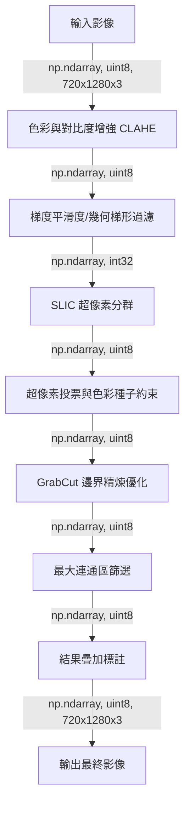
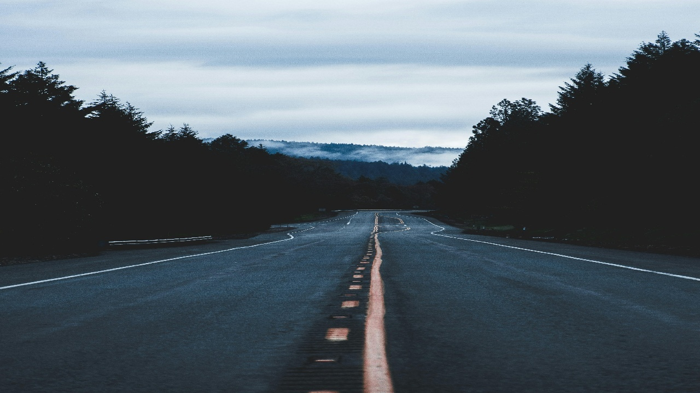
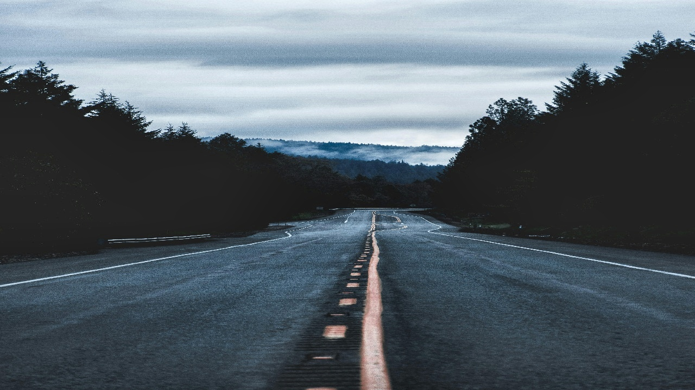
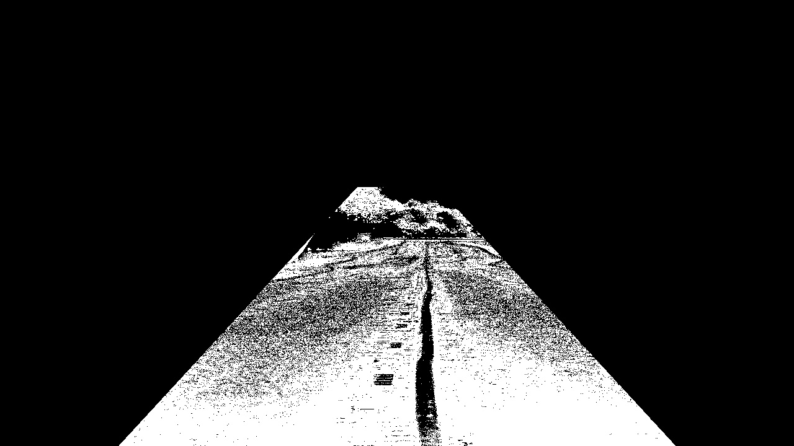
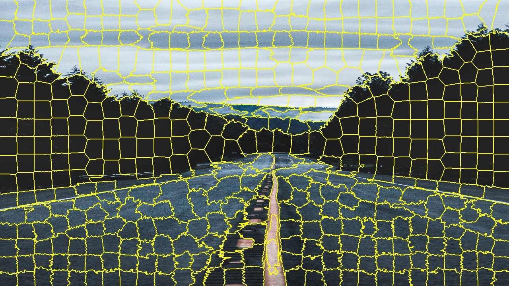
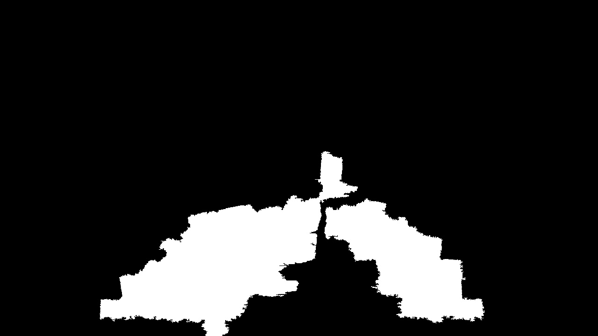
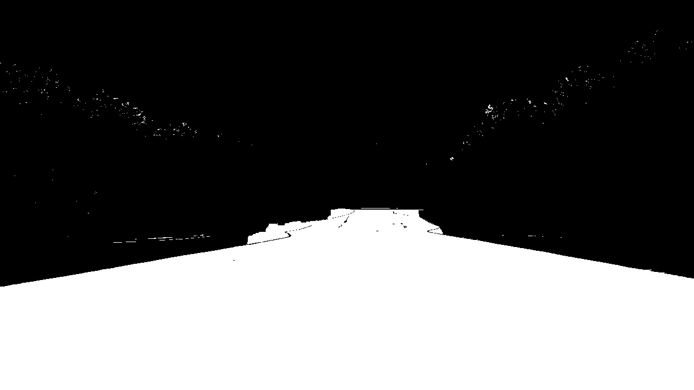
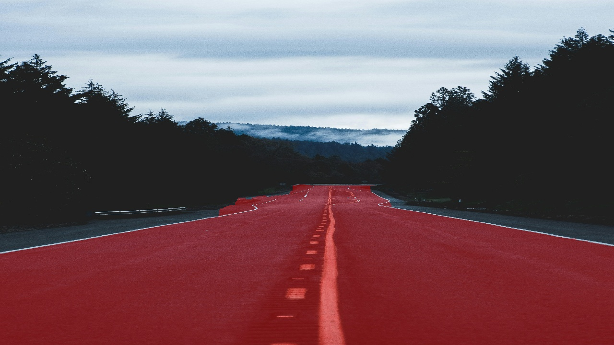

# Road Detection (道路辨識)

## 一、需求
* **功能**：於道路區域疊加 半透明紅色標記之影像。
* **限制**：含直線道路、街景及天空之影像。解析度**：以 **1280x720** 為基準。
* **界面**：以 png檔案輸入。

## 二、分析
本專案專注於 多重 openCV function 以排除非道路干擾：

| 特徵類別 | 技術說明 | 偵測目的 |
| :--- | :--- | :--- |
| **色彩特徵** | HSV 瀝青灰與標線黃/白色彩遮罩 | 識別道路基本色調與標線邊界 |
| **空間幾何** | **Tight ROI** 梯形投影遮罩 (收窄底邊) | 強力排除兩側斜坡、人行道與招牌 |
| **紋理特徵** | Sobel 梯度平滑度計算 | 排除碎石、樹木等高紋理之非道路雜訊 |
| **區域連貫性** | SLIC 超像素分群與 **Seed Color** 約束 | 強化邊界貼合度，依據種子色排除干擾物 |

## 三、設計
### 1. 系統流程 (Pipeline)

## 四、驗證
### 1. 階段性對比 (Stages Comparison - Road 01)
展示完整 Pipeline 的 8 個處理階段結果與演算法細節：

| 階段 | 說明 | 影像結果 |
| :--- | :--- | :--- |
| **Stage 1** | **原始影像**：輸入 1280x720 之 png/jpg 格式影像。 |  |
| **Stage 2** | **影像預處理**：採用 CLAHE (`cv2.createCLAHE`) 提升暗部路面對比度。 |  |
| **Stage 3** | **幾何與紋理約束**：建構動態 **Tight ROI** 與 Sobel 梯度遮罩，有效解決影像兩側斜坡誤判問題。 |  |
| **Stage 4** | **SLIC 分群**：將影像分割為 500 個超像素區塊，增加邊界細節捕捉能力。 |  |
| **Stage 5** | **色彩種子約束**：計算超像素與「**路面種子 (Seed Color)**」的色彩距離，作為排除干擾物之投票門檻。 |  |
| **Stage 6** | **GrabCut 精煉**：以投票結果為基礎進行 3 次迭代，自動優化切割邊界。 |  |
| **Stage 7** | **最大連通區**：定位影像中面積最大且符合幾何特徵的物件作為主道路。 |  |
| **Stage 8** | **結果疊加**：影像透明度疊加顯示，完成道路區域標註標記。 |  |

### 2. 不同樣本對比 

*Fig 1.1 處理流程：原始影像 ➜ 綜合特徵遮罩 ➜ 最終優化結果 (Image 1)*

*Fig 1.2 處理流程：原始影像 ➜ 綜合特徵遮罩 ➜ 最終優化結果 (Image 2)*

*Fig 1.3 處理流程：原始影像 ➜ 綜合特徵遮罩 ➜ 最終優化結果 (Image 3)*

*Fig 1.4 處理流程：原始影像 ➜ 綜合特徵遮罩 ➜ 最終優化結果 (Image 4)*

*Fig 1.5 處理流程：原始影像 ➜ 綜合特徵遮罩 ➜ 最終優化結果 (Image 5)*

*Fig 1.6 處理流程：原始影像 ➜ 綜合特徵遮罩 ➜ 最終優化結果 (Image 6)*

### 3. 測試統計 (Benchmarking)
針對 7 張測試影像進行自動化評估，結果如下：

| 指標 | 數值 | 說明 |
| :--- | :--- | :--- |
| **平均道路面積 (Avg Area)** | 15.24% | 偵測到之道路佔影像比例 |
| **平均實心度 (Avg Solidity)** | 2.190 | 數值愈高代表道路區域愈完整且無破洞 |
| **平均鋸齒度 (Avg Jagged)** | 0.04325 | 數值愈低代表邊界愈平滑 |

---

## 五、參考資料 (References)
1. **Achanta, R., et al.** "SLIC Superpixels Compared to State-of-the-art Superpixel Methods." *IEEE PAMI*, 2012.
2. **Rother, C., et al.** "GrabCut: Interactive Foreground Extraction using Iterated Graph Cuts." *ACM SIGGRAPH*, 2004.

